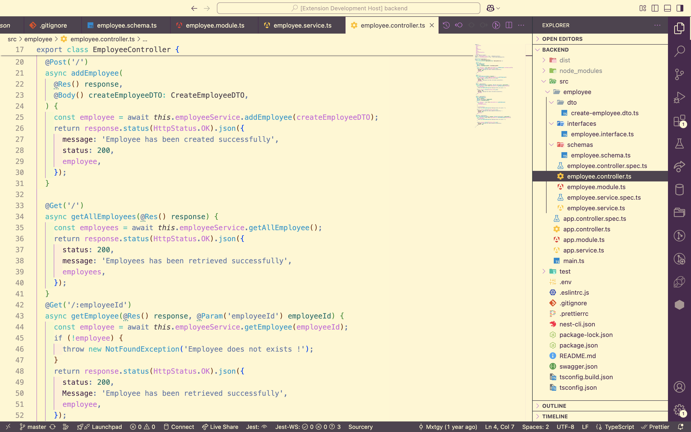

  

<h1 align="center">Nippon Chroma Theme</h1>

A Japan-inspired light theme for VS Code with soft pastels and deep violets, balancing readability and visual comfort for long coding sessions.

## Preview

You can preview this theme : [Theme preview](https://vscode.dev/editor/theme/maximetanguy.nippon-chroma-theme)

## Installation

* Open the Extensions sidebar panel.
* Search for `Nippon Chroma`.
* Click on the Install button.
* Click on the Reload button.
* Then select the theme. `Code` > `Preferences` > `Theme` > `Color Theme` > `Nippon Chroma`.

**Enjoy!**
